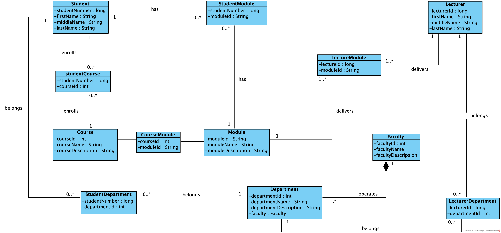

# College Management System
This is an application for managing 
student, courses and lecturer's information.

---
## System's UML Diagram

---
## Collaboration Rules
---

### Commit Messages
All commits made in this project should follow the convention below.
A commit should have 3 parts
1. Type
2. Colon
3. Description of the task under the give task. ***Short and precised***

#### See examples below
---
> A commit for a newly added entity
`TASK: Added and implemented domain entity car.`

> A commit for a bug fix.
`BUG FIX: Fixed null pointer reference for car objects caused by an uninitialized object in vehicle.`
**[NOTE]** You can omit the cause if you want to But it is strongly recommended you put the cause of the Bug so 
that in later stages, if one of the team member(s) go through the same error the commit message might be of 
some help to them to track down their cause.

> A commit for a new feature
`FEATURE: Added session tracking for logged-in users`
---
